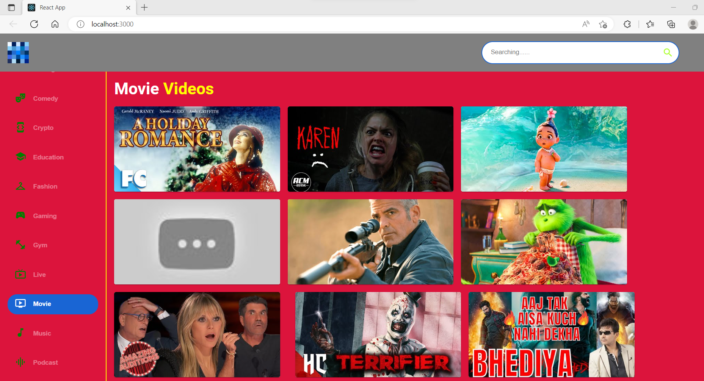
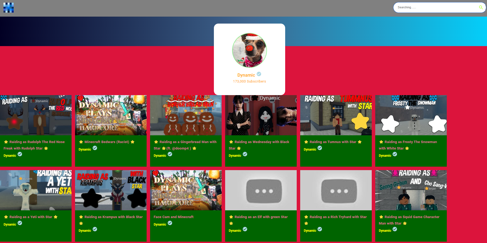
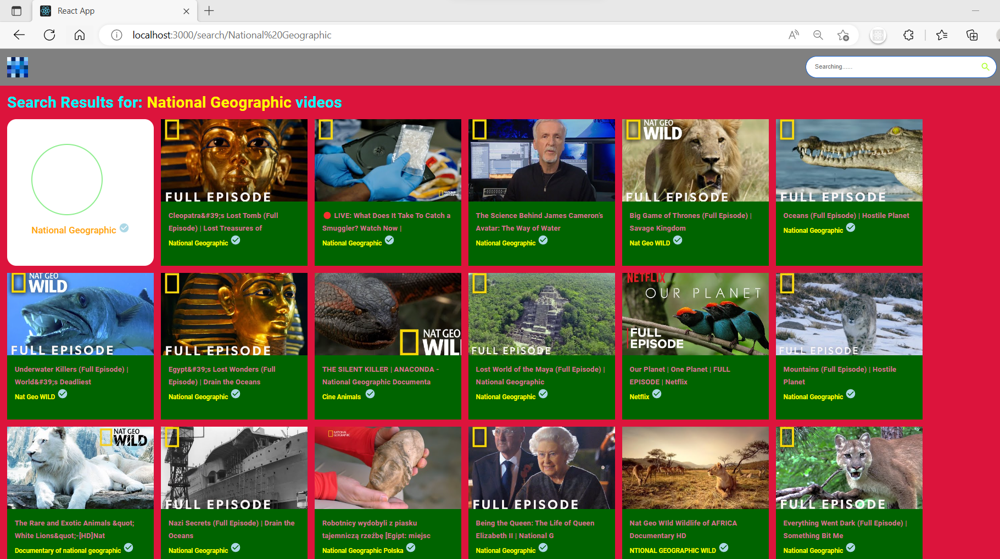
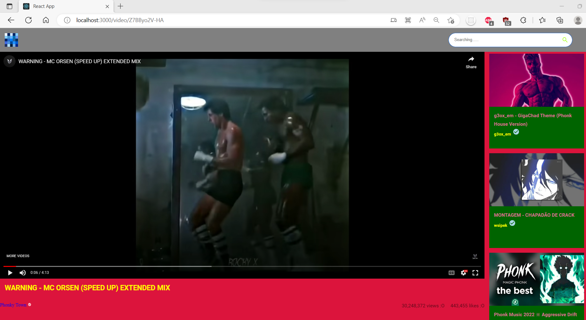

# tubular-vision

## Summary
<p>Creating video platform site which fetches videos and data from
YouTube API</p>

<hr>

## Tech Stack / Tools
- [React library](https://reactjs.org/docs/getting-started.html)
- [Material UI](https://mui.com/material-ui/getting-started/overview/)
- [Rapid API](https://rapidapi.com/)
- [YouTube API](https://rapidapi.com/ytdlfree/api/youtube-v31/)

<hr>

## Get Started / Local Setup
```
git clone https://github.com/WackyChomp/tubular-vision.git

npm install --legacy-peer-deps

npm start
```
<hr>

## Images / Progression
<p><u>November 27, 2022</u> - WIP colors, intended for distinction</p>


<br>

<p><u>December 13, 2022</u> - Display videos on specific channel id</p>


<br>

<p><u>December 19, 2022</u> - Display content through search bar</p>


<br>

<p><u>December 23, 2022</u> - Display Video Detail and Video components</p>

